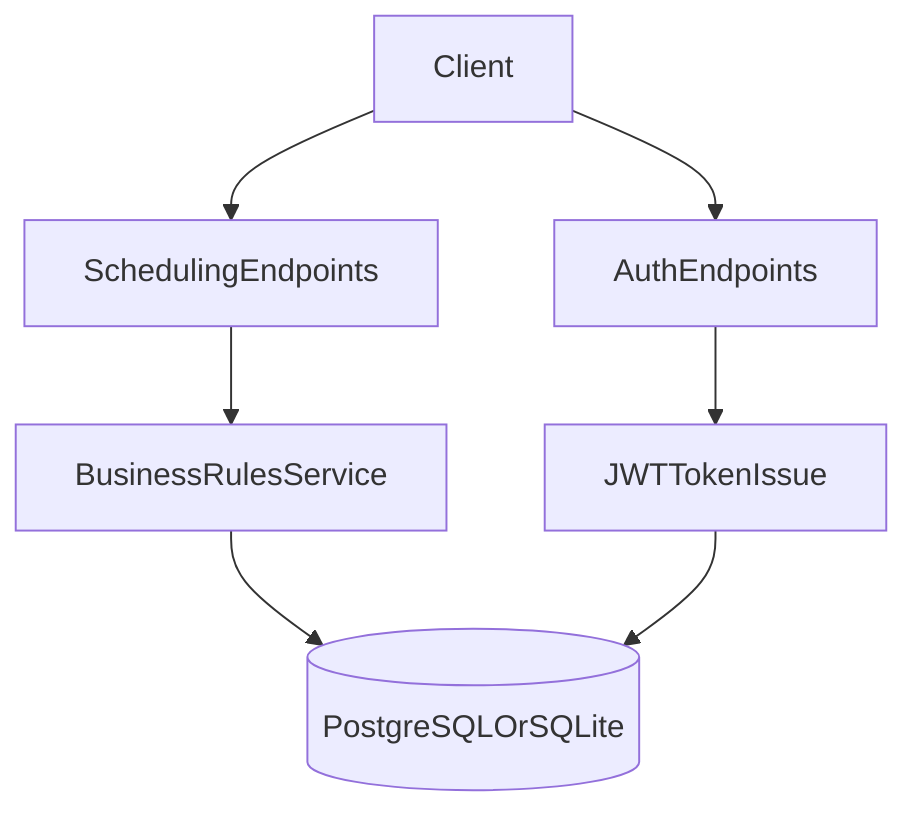

# Architecture

## High-Level Modules

- `authentication`: custom user model, roles, JWT-oriented auth endpoints.
- `scheduling`: doctor/patient profiles, schedules, visit lifecycle and rules.
- `server`: project settings, routing, global API entrypoints.

## Domain Model

- `User` with role (`doctor`, `patient`)
- `DoctorProfile` (physical address)
- `PatientProfile` (phone + exactly one `primary_doctor`)
- `WeeklyScheduleSlot` (default working hours with break support via multiple slots)
- `TemporaryScheduleChange` + `TemporaryScheduleSlot`
- `PermanentScheduleChange` + `PermanentScheduleSlot`
- `Visit` (scheduled/cancelled with metadata)

## Business Rules Placement

- Input shape validation in serializers.
- Core visit rules and cancellation logic in `scheduling/services.py`.
- Endpoint-level access restrictions via DRF permissions.

## Data/Request Flow

## Why this structure

- Keeps rule-heavy logic outside views for testability.
- Uses explicit role boundaries for doctor/patient behavior.
- Supports both local test workflow (SQLite) and Docker runtime (PostgreSQL).
